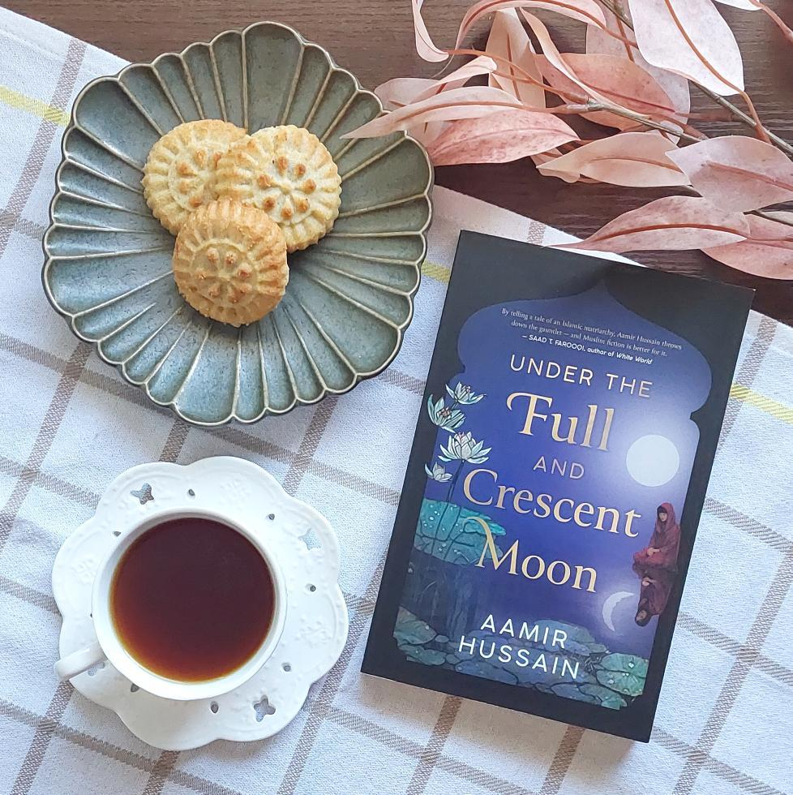

# All the things

It's surprising the number of things that need to be done *after* you're done writing a book to give it a good shot in the market. There's a lot of supplementary writing to do, and, nowadays, a whole lot of marketing effort that authors need to be put in too with things like making a website, newsletter, social media post and things like that. And I've done all of that and continue to do so for my novel "Under THe Full and Crescent Moon"

<!-- more -->

I've even made graphics on Canva, and I'm happy with my results, they get the job done. But there are limits to what any one person can do and I'm not an artist.

## What comes from others

Which is why it's so mind blowing to see people who've read the book make graphics that I could never have done.

Here's one from @msbookmarked on Instagram who makes amazing social media posts pairing books with deserts. I can't take pictures like this and for her to have paired the book with the Palestinian date pastry Ma'amoul is just perfect. For somebody to have done something for the book that I cannot is.. it's indescribable.

<figure markdown="span">
  { width="300" }
  <figcaption>Artistic Picture of the novel "Under The Full And Crescent Moon" from msbookmarked</figcaption>
</figure>

And here's the kind of graphic that I've seen so many books have from @anathereader on Instagram and TikTok and like I said I've done some stuff on Canva but I know my limitations and I just don't have the artistic sense to create anything like this. That someone who can, did, is, there's really no words for it.

<figure markdown="span">
  { width="300" }
  <figcaption>Artistic social media post depicting the novel "Under The Full And Crescent Moon" with text descriptions</figcaption>
</figure>

When I wrote "Under The Full and Crescent Moon", of course I wanted it to be enjoyable and accessible and of value to others, and I worked very hard on that, but I wasn't really thinking about how other people would react to it. I wrote the book because I needed to, it was inside of me and I needed to get it out at *some* level of quality. But when I finished, my deepest desire was that it would be able to get out into the world and find its readers and hopefully inspire them.

There's no greater proof of that happening than what these two creators have crafted in response to my creation. It's a precious gift and I'm always going to be thankful to them for that.
