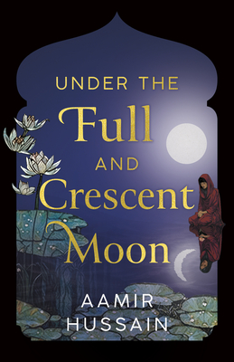

# Preorder Now!

There are a lot of milestones that I'm looking forward to as a new author. Seeing the book in my local library or in a bookstore, holding it in my hands for the first time. I am incredibly grateful to have these events to look forward to Inshallah.

Two of those milestones have been reached this month. The first is preorders have opened for Canada and the United States, Alhamdulillah!

I would be really honoured if you could preorder it. The various options are on my link tree [Here](https://linktr.ee/aamirauthor){ target="_blank" }

The second is the cover reveal! Click on for more.

<!-- more -->

## Cover

<figure markdown="span">
  { width="300" }
  <figcaption>Cover of "Under The Full And Crescent Moon"</figcaption>
</figure>

What do you think of it? Please let me know. I'm personally very happy with how it turned out. Not to spoiler anything but some of the details really refer to events in the novel. Overall I really feel it reflects the themes of the novel as well as the title itself (The reflection allows the moon to be both full AND Crescent). I am grateful to Dundurn press for taking my thoughts on the elements I wanted the cover to have and turning those ideas into what you see.

I'm so looking forward to holding it in my hands physically, Inshallah.

## Emotion

Seeing the cover and seeing the novel with a release date in online book stores is, honestly, surreal. I am incredibly thankful to have gotten to this point. It's also a testament to so much work that happens behind the scenes, which is all done by the publisher, Dundurn Press, and all credit goes to them for this, as well as the cover design.

## Site overhaul

I was always planning to overhaul the theme of my site to match the cover of the novel and I worked really hard on it. Creating a website is the closest that I will ever come to being an artist and making creative choices about every detail that I can control is really something equally rewarding and terrifying. If you liked the original theme then it's still available, there's a toggle button right at the top of the site for it.

I am fortunate enough to live in a time where I can get so much help from online resources, without which the 'starry' background effect would not have been possible. It still took me a full day of tweaking code to get it to work they way I wanted it to. Probably not time well spent, but I'm satisfied with the end result. What do you think? I'd love to know.

## Another blog post

I am realizing that I have a space here to post about things that are on my mind, and that it's healthier to do so rather than have them knocking about in my head.

[Here's](./threereasonswhy.md) something I wrote about some reasons why I feel so much of us ignore Palestine. During our own important moments, we need to keep thinking, talking and acting for Palestine and the Palestinian people.

Until next time!
