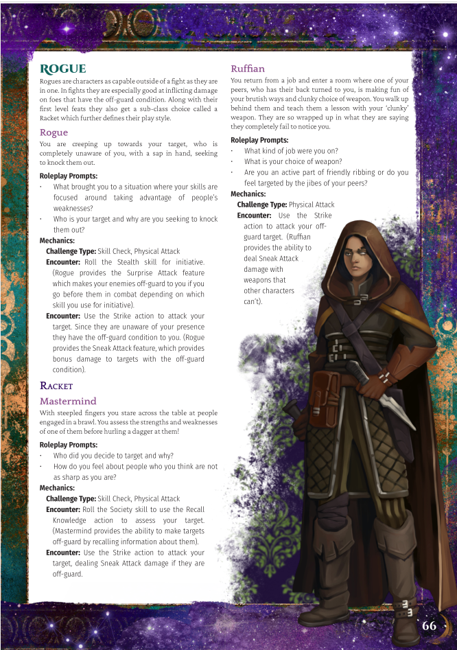

## OriginPath Intro

Why wait till you've made a character to start playing PF2e when with OriginPath, you can play ***as*** you're making a character. OriginPath is a supplement that turns character creation in PF2e into a whole minigame on its own that can be used as a tutorial to learn the game and a guide to the character sheet for new players, and as a tool to enrich character backstories for GMs and Players of all skill levels!

This nearly 80 page supplement not only contains all the easy to follow rules of OriginPath but also mini gameplay segments for almost every first level character option from the Pathfinder 2nd Edition Player Core Rule book to play with the new powers of your characters right as you choose them. It can be used as a solo experience or by a GM looking to enhance character creation for their players right at session zero.

All author proceeds will go to Palestine relief charities.

Store Links:

[Origin Path at Itch.io](https://eldritch-osiris-games.itch.io/origin-path)

[Origin Path at DriveThruRpg](https://www.drivethrurpg.com/en/product/505890/origin-path?affiliate_id=1799788)

<figure markdown="span">
  { width="300" }
  <figcaption>Origin Path Cover</figcaption>
</figure>

<figure markdown="span">
  { width="300" }
  <figcaption>Teaser for Rogue Class</figcaption>
</figure>

## Thoughts on the system

Pathfinder Second Edition has a character creation system that has a *lot* of options. Which is great, but also can be overwhelming.

But what the character creation system also does is create characters step by step in what Paizo calls the 'ABCs' of character creation. Where you first pick the Ancestry of a character, then the Background of what they were doing before they become heroes, and finally the Class which is where they get most of their amazing abilities from.

As soon as I heard this, what came to mind immediately for me was that his traces the life path of a character almost perfectly. And then from there I thought... why not pause at each one of those steps and engage with the abilities that come with them. And from that thought came OriginPath where I have written rules on how to do this and... kind of had to engage with almost every first level option that the game provides to determine how best to explain each one.

It was a *lot* of work and then I was kind of stumped on what to even do with it. Luckily one of the first people I reached out to was James from Eldritch Osiris Games who are one of the premier creators of third party content for Pathfinder Second Edition, and I've partnered with them to bring it out as a pdf!

This was really a labour of love. The only way I was able to get the idea out of my head was to get it onto a page, and I am just really grateful that it can come out into the world in a way that others might find helpful!

## Videos

[Introduction Video](https://youtu.be/0xwSEw5RFG0)

[Walkthrough with form fillable pdf](https://youtu.be/3jQXTcyRwpw)
