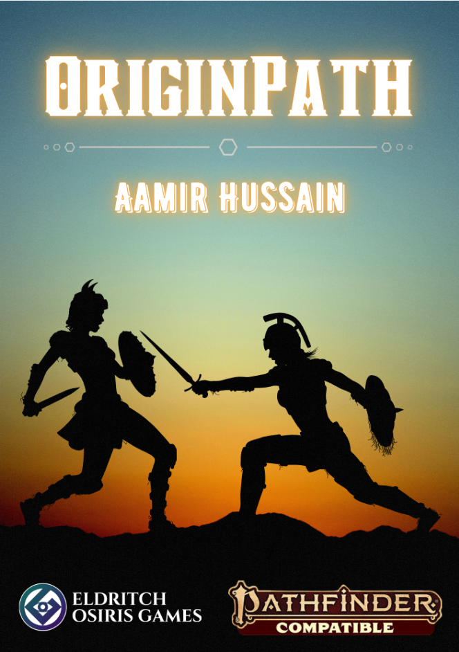

## Pathfinder Second Edition

I started playing ttrpgs with Pathfinder First Edition in 2014, about five years later the second edition of the game was released and, I really really love both playing and GMing it.

Enough that I have created YouTube videos providing commentary on the rules, creatures for the game, and a massive supplement for character creation that I call the 'OriginPath' system that IS NOW AVAILABLE FOR PURCHASE thanks to a partnership with the excellent [Eldritch Osiris Games](https://www.eldritchosirisgames.com/).

### OriginPath

Why wait till you've made a character to start playing PF2e when with OriginPath, you can play ***as*** you're making a character. OriginPath is a supplement that turns character creation in PF2e into a whole minigame on its own that can be used as a tutorial to learn the game and a guide to the character sheet for new players, and as a tool to enrich character backstories for GMs and Players of all skill levels!

Store Links:

[Origin Path at Itch.io](https://eldritch-osiris-games.itch.io/origin-path)

[Origin Path at DriveThruRpg](https://www.drivethrurpg.com/en/product/505890/origin-path?affiliate_id=1799788)

All author proceeds will go to Palestine relief charities.

<figure markdown="span">
  { width="300" }
  <figcaption>Origin Path Cover</figcaption>
</figure>

More information at the [Main Origin Path page](pf2eoriginpath.md)

### Why'd you do that pf2e?

[A YouTube channel with commentary and rules on the game](https://www.youtube.com/@wydtpf2e612). My hope is I'll be able to get through the Player Core Rulebook at some point Inshallah, but God may have other plans.

### Auto calculating pdf sheet

One of the features of the OriginPath system I wrote is going through PF2e character creation step by step. A really ideal way to see this in operation is to see an auto calculating sheet populate some of the tedious parts of filling out the sheet and demonstrate exactly what the fun consequences are of character creation choices.

Unfortunately auto calculating pdfs have gone out of style in favour of full blown character creation apps such as the excellent [Pathbuilder 2e](https://pathbuilder2e.com/)

So I took a form fillable pdf created by [CaptainKohog on Reddit](https://reddit.com/u/CaptainKohog) and got a free trial of Adobe Acrobat in order to put in form calculations.
You can find it [here](https://drive.google.com/file/d/1qAED-OD1fCT7gRhQlH5yD9hMlTHUQMk0/view?usp=sharing)

### Monsters

I entered the Rpg Superstar 2023 monster creation competition and while I didn't do too well. I'm still proud of the two critters I created.

* [Slurry Shambler](https://rpgsuperstar.com/creatures/3200) An ice and mud themed elemental that I feel would be fun to throw at your players in a spring thaw sort of season.
* [Gravelight](https://rpgsuperstar.com/creatures/3561) A high concept low level ally creature for most undead hunting campaigns or a foe for an undead party.
