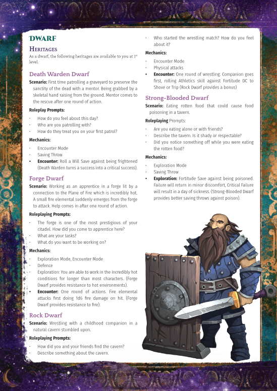

## Pathfinder Second Edition

I started playing ttrpgs with Pathfinder First Edition in 2014, about five years later the second edition of the game was released and, I really really love both playing and GMing it.

Enough that I have created YouTube videos providing commentary on the rules, creatures for the game, and a massive supplement for character creation that I call the 'OriginPath' system that should be out very soon thanks to a partnership with the excellent [Eldritch Osiris Games](https://www.eldritchosirisgames.com/).

### OriginPath

Pathfinder Second Edition has a character creation system that has a *lot* of options. Which is great, but also can be overwhelming.

But what the character creation system also does is create characters step by step in what Paizo calls the 'ABCs' of character creation. Where you first pick the Ancestry of a character, then the Background of what they were doing before they become heroes, and finally the Class which is where they get most of their amazing abilities from.

As soon as I heard this, what came to mind immediately for me was that his traces the life path of a character almost perfectly. And then from there I thought... why not pause at each one of those steps and engage with the abilities that come with them. And from that thought came OriginPath where I have written rules on how to do this and... kind of had to engage with almost every first level option that the game provides to determine how best to explain each one.

It was a *lot* of work and then I was kind of stumped on what to even do with it. Luckily one of the first people I reached out to was James from Eldritch Osiris Games who are one of the premier creators of third party content for Pathfinder Second Edition, and I've partnered with them to bring it out as a pdf!

This was really a labour of love. The only way I was able to get the idea out of my head was to get it onto a page, and I am just really grateful that it can come out into the world in a way that others might find helpful!

Watch this space for more release details!

Here's a teaser image:
<figure markdown="span">
  { width="300" }
  <figcaption>Teaser for Dwarf Heritage</figcaption>
</figure>

### Why'd you do that pf2e?

[A YouTube channel with commentary and rules on the game](https://www.youtube.com/@wydtpf2e612). My hope is I'll be able to get through the Player Core Rulebook at some point Inshallah, but God may have other plans.

### Monsters

I entered the Rpg Superstar 2023 monster creation competition and while I didn't do too well. I'm still proud of the two critters I created.

* [Slurry Shambler](https://rpgsuperstar.com/creatures/3200) An ice and mud themed elemental that I feel would be fun to throw at your players in a spring thaw sort of season.
* [Gravelight](https://rpgsuperstar.com/creatures/3561) A high concept low level ally creature for most undead hunting campaigns or a foe for an undead party.
